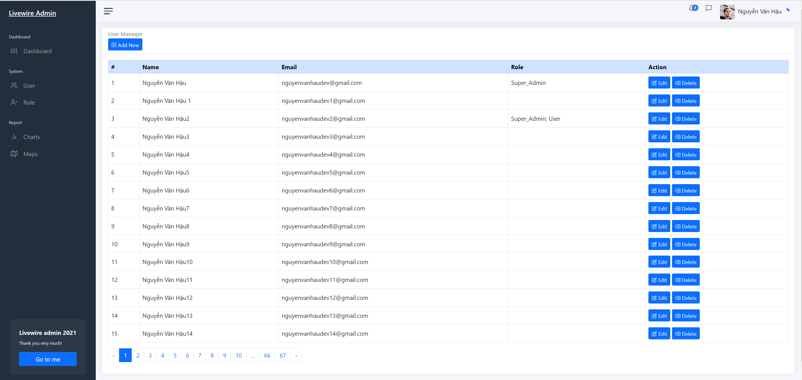
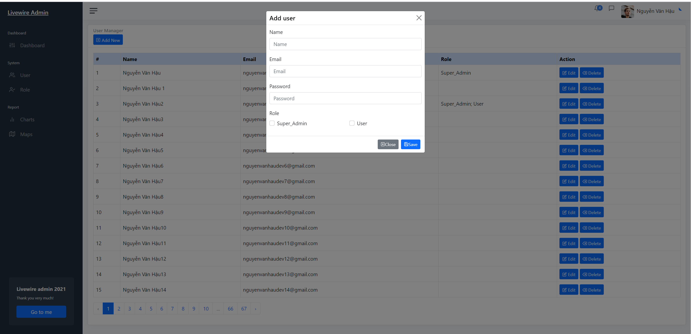
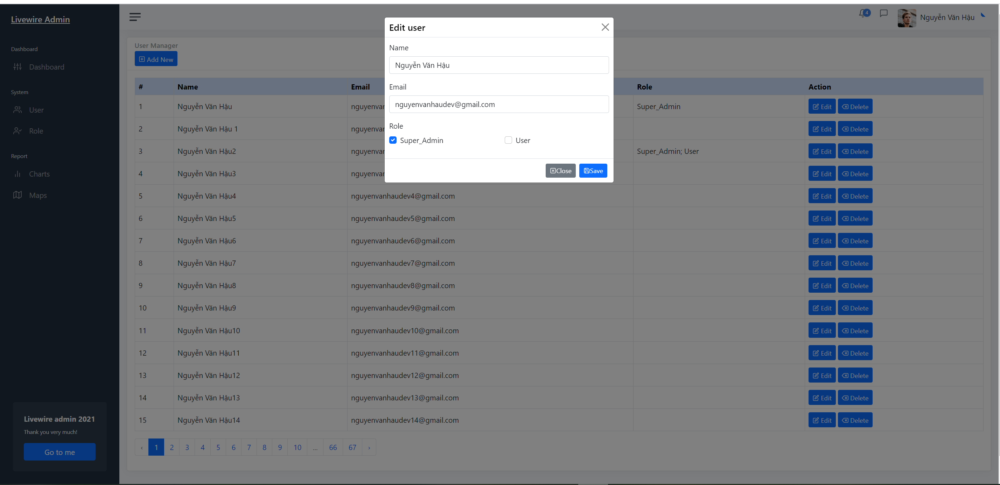
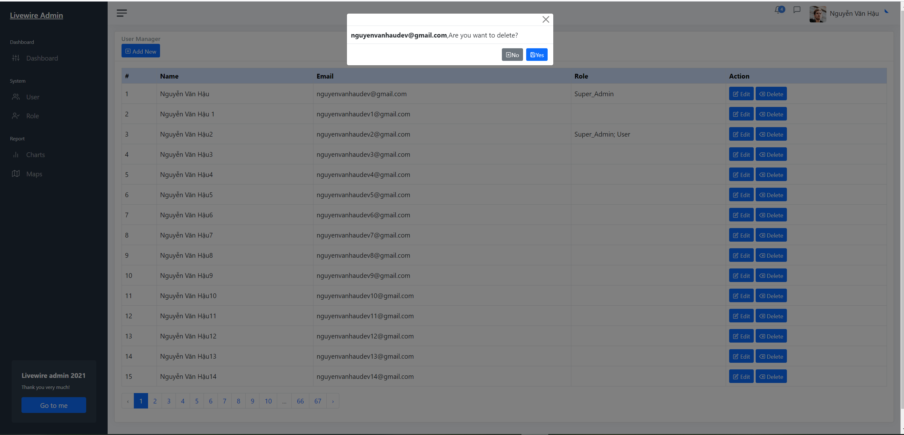
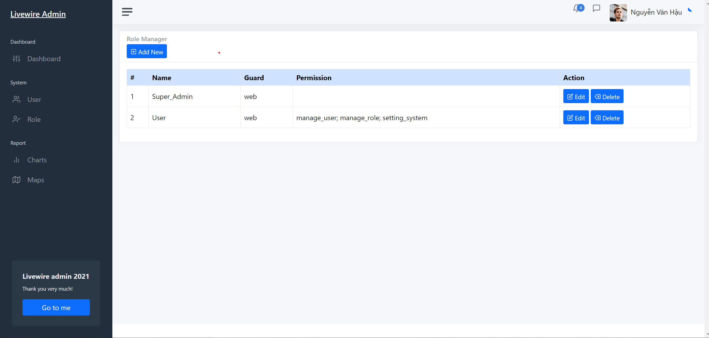
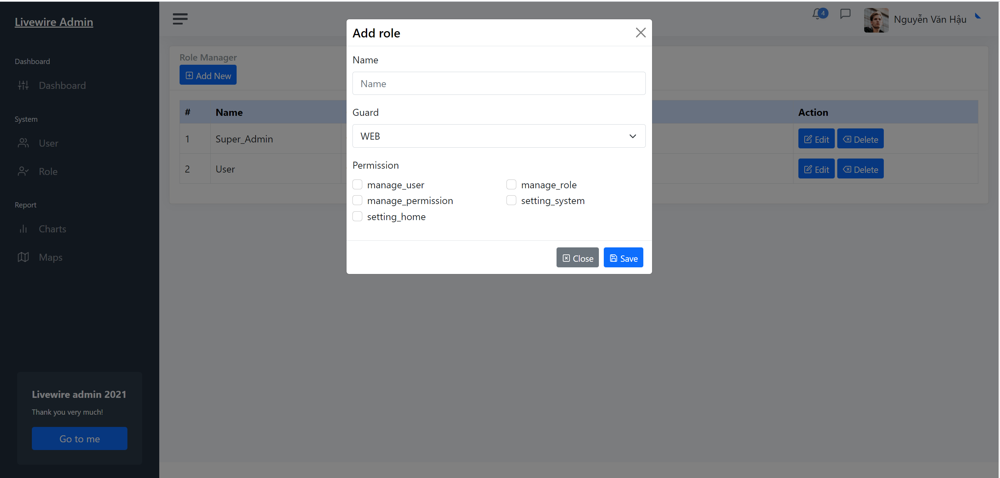
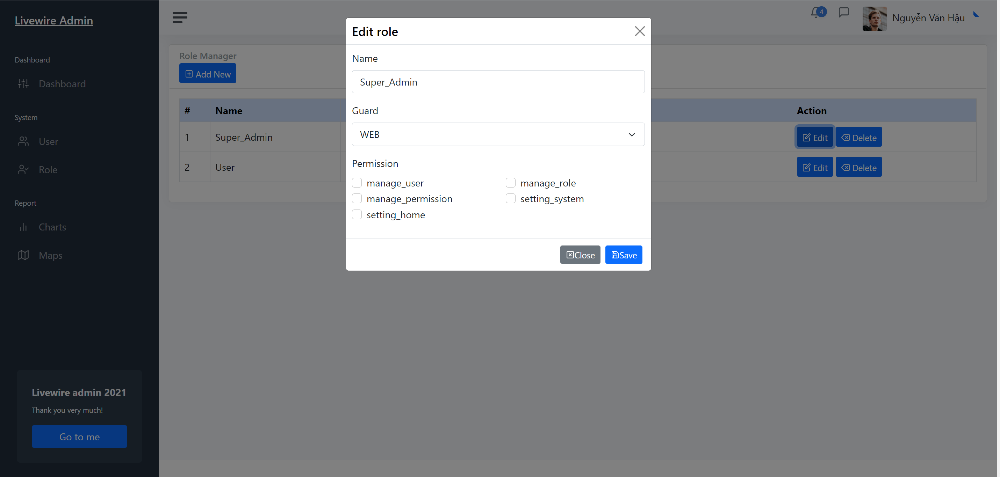

<p align="center">
  <a href="" rel="noopener">
 </a>
</p>

<h3 align="center">Livewire Admin</h3>

<div align="center">

[]()
[](https://github.com/devhau/livewire-admin/issues)
[](https://github.com/devhau/livewire-admin/pulls)
[](/LICENSE)

</div>

---

<p align="center"> Few lines describing your project.
    <br> 
</p>

## 📝 Table of Contents

- [About](#about)
- [Getting Started](#getting_started)
- [Deployment](#deployment)
- [Usage](#usage)
- [Built Using](#built_using)
- [TODO](../TODO.md)
- [Contributing](../CONTRIBUTING.md)
- [Authors](#authors)
- [Acknowledgments](#acknowledgement)

## 🧐 About <a name = "about"></a>

Write about 1-2 paragraphs describing the purpose of your project.

## 🏁 Getting Started <a name = "getting_started"></a>

These instructions will get you a copy of the project up and running on your local machine for development and testing purposes. See [deployment](#deployment) for notes on how to deploy the project on a live system.

### Prerequisites

What things you need to install the software and how to install them.

### Installing

A step by step series of examples that tell you how to get a development env running.

Say what the step will be

```
composer install
```
```
npm install
```

```
php artisan migrate --seed
```

```
php artisan serv
```

```
go to : http://127.0.0.1:8000/admin
```

```
account : nguyenvanhaudev@gmail.com
password : @1234
```
End with an example of getting some data out of the system or using it for a little demo.

## Sreens






















## 🔧 Running the tests <a name = "tests"></a>

Explain how to run the automated tests for this system.

### Break down into end to end tests

Explain what these tests test and why

```
Give an example
```

### And coding style tests

Explain what these tests test and why

```
Give an example
```

## 🎈 Usage <a name="usage"></a>

Add notes about how to use the system.

## 🚀 Deployment <a name = "deployment"></a>

Add additional notes about how to deploy this on a live system.

## ⛏️ Built Using <a name = "built_using"></a>

- [Laravel 8](https://www.laravel.com/) - Server Environment
- [Livewire 2](https://laravel-livewire.com) - Fullstack
- [alpinejs 2.8.*](https://github.com/alpinejs/alpine) - JavaScript framework 
- [Bootstrap 5](https://getbootstrap.com/) - Web Framework
- [@adminkit/core](https://github.com/adminkit/adminkit) - Template for admin

## ✍️ Authors <a name = "authors"></a>

- [@devhau](https://github.com/devhau) - Idea & Initial work

See also the list of [contributors](https://github.com/https://github.com/devhau/livewire-admin/contributors) who participated in this project.

## 🎉 Acknowledgements <a name = "acknowledgement"></a>

- Hat tip to anyone whose code was used
- Inspiration
- References
